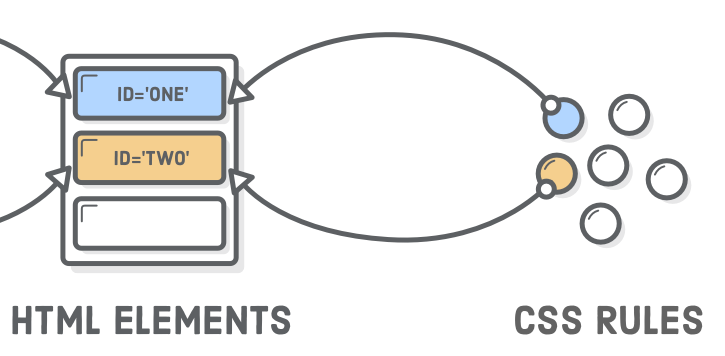

# CSS (Cascading Style Sheets)
CSS is a **style sheet language** used for describing the presentation of a document written in a markup language like HTML.

**Why is it a separate language?** 

It serves a completely different purpose. HTML represents the content of your web page, while CSS defines how that 
content is presented to the user (the visual design). 

> With CSS we are defining **presentational** information instead of contributing to the **semantic** meaning of the underlying content.

_HELLO CSS, Nº 4. of HTML & CSS Is Hard_
    
## Syntax
CSS has a simple syntax and uses a number of _English keywords_ to specify the names of various style properties


## Linking a CSS file with an HTML

```html
<!-- hello-css.html -->
<head>
  <meta charset='UTF-8'/>
  <title>Hello, CSS</title>
  <link rel='stylesheet' href='styles.css'/>
</head>
```
This `<link/>` element is how browsers know they need to load the CSS files.


### Location of Styles
Check the slide `Chapter04-IntroductionToCSS.pptx` (Section 3) to see a complete example.
Here a summary:

| Name                 | Location                                                             |  Example                                       |
| -------------------- | -------------------------------------------------------------------- | ---------------------------------------------- |
| External Style Sheet | In a separated file.                                                 | `<link rel='stylesheet' href='styles.css'/>`   |
| Embedded Style Sheet | In the same HTML file, in the header on a `style` block.             | `<style> h1 {font-size: 14px} </style>`        |
| Inline Styles        | The CSS rules are located in the style attribute of an HTML element. | `<p style="color:red"> Hello, CSS <p> `        |


### The selector
The selector **links** a single or a set of HTML elements to a given CSS rule.

_This makes it possible to selectively style individual elements while ignoring others._

#### HTML elements selectors


```css
p {
  color: red;
  font-style: italic;
}
```
```html
<p>Hello, CSS</p>
<p>Hello, HTML</p>
```
<p style="color: red; font-style: italic">Hello, CSS</p>
<p style="color: red; font-style: italic">Hello, HTML</p>

#### Id selectors


```css
#first-paragraph {
  color: red;
  font-style: italic;
}
```
```html
<p id="first-paragraph">Hello, CSS</p>
<p>Hello, HTML</p>
```
<style>
#first-paragraph {
  color: red;
  font-style: italic;
}
</style>
<p id="first-paragraph">Hello, CSS</p>
<p>Hello, HTML</p>

#### Class selectors


Example:

```css
.primary {
  color: red;
  font-style: italic;
}
```
```html
<p class='primary'>Hello, CSS</p>
```
<style>
.primary {
  color: red;
  font-style: italic;
}
</style>
<p class="primary">Hello, CSS</p>

#### Descendant Selectors


Example:

```css
.primary {
  color: red;
  font-style: italic;
}
.primary em {
    font-style: normal;
}

```
```html
<p class="primary">Hello, <em>CSS</em></p>
```

<style>
.primary em {
    font-style: normal;
}
</style>
<p class="primary">Hello, <em>CSS</em></p>

#### Pseudo-classes


Example:
```css
    input#pseudo-class {
        color: red;
    }
    
    input#pseudo-class:active {
        background-color: orange;
    }
    
    input#pseudo-class:hover {
       color: blue;
    }
```
```html
<input type="button" id="pseudo-class" value="Click me!"/>
```

<style>
    input#pseudo-class {
        color: red;
    }
    
    input#pseudo-class:active {
        background-color: orange;
    }
    input#pseudo-class:hover {
        color: blue;
    }
</style>
<input type="button" id="pseudo-class" value="Click me!"/>

_We can combine the different kind of selectors!_
Check the slide `Chapter04-IntroductionToCSS.pptx` (Section 4) for further information.


## The Cascade Effect
The “cascading” part of CSS is due to the fact that rules cascade down from multiple sources. 


This is ordered from least to most precedence, which means styles defined in each subsequent step override previous ones.

For further details refer to the bibliography.

## References
* [https://en.wikipedia.org/wiki/Cascading_Style_Sheets](https://en.wikipedia.org/wiki/Cascading_Style_Sheets)
* [https://internetingishard.com/html-and-css/hello-css/](https://internetingishard.com/html-and-css/hello-css/)
* [https://internetingishard.com/html-and-css/css-selectors/](https://internetingishard.com/html-and-css/css-selectors/)